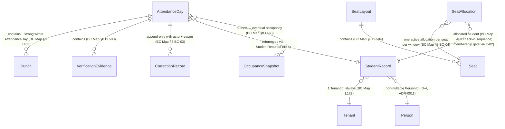

# Liboora Attendance ERD — Source Transcription (Read-Only)

| Field | Value |
|---|---|
| **Type** | Architecture / data-model transcription — **not** database implementation |
| **Scope** | Attendance only — `BC-03 Attendance` + its authorised read neighbours (`BC-01`, `BC-04`, `BC-10`, `BC-18`, `BC-19`) |
| **Status** | **Unranked design artifact** — transcription only; confers nothing · Sole authority for attendance facts remains `BC-03` per `ATT-FR-001` (`PRD-006` v1.9 FROZEN) |
| **Sources** | Listed beside every claim below — `LIBOORA_BOUNDED_CONTEXT_MAP.md` §8, `PRD-006` v1.9 (`ATT-FR-001`), `E-02`/`E-35`/`E-24`, `LIB-14B.11–.14`, `ID-2`/`ID-4`, `D-3a` (`ATT-GAP-015`) |
| **Implementation** | ⛔ **No columns, types, enums, indexes, keys, RLS, DDL, migrations, APIs, permissions, workflows, or UI states are owed by this document** |
| **Retention** | Purge/TTL **Unresolved** — see §6 (`ATT-GAP-005` / `AUD-GAP-001`); `Q-04`/`MP-DEP-07` interim policy `RET-01`…`RET-13` is **not** an attendance retention rule |

> **This document does not amend any PRD, ADR, aggregate, invariant, edge, or permission.** Where it disagrees with a source, the source is right and this document is a defect.

---

## 1. Authority & boundary

- `PRD-006` v1.9 **FROZEN** is admitted to Rank 3 by `ADR-0034` (`BASELINE-2026-08-05-A`). The authoritative aggregate catalogue is **BC Map §8** (Rank 4) as read through that PRD.
- `BC-03 Attendance` is **sole owner of the `AttendanceDay` aggregate and every attendance fact** — `ATT-FR-001` (`PRD-006` §3) and `ATT-AC-119` (`Every attendance fact … is reachable through an AttendanceDay`). No other context may emit or own an attendance fact.
- `AttendanceDay` = **one student, one tenant, one calendar date** — `PRD-006` §2.3 *inherited, not invented*: BC Map §8.1 deliberately makes it the aggregate (not a punch) because the invariants that matter (check-out after check-in; one open session; idempotent punch) are all **day-scoped**.
- Face attendance (`ATTENDANCE_MODE_FACE`, `PRD-006` §12) is **V3** per **D-3a** (`ATT-GAP-015` decision record, Product Owner, ARB pending — `ATT-GAP-015` OPENARBPending) and is **excluded from this V1 ERD**. `RFID/NFC/BLE` equally excluded (`ATT-XC-010` — seventh mode only via §7.1a). No other mode is added.

---

## 2. Entities — exactly what BC Map §8 names (no column invented)

| Entity | Meaning | Source | Aggregate / ownership |
|---|---|---|---|
| `AttendanceDay` | **Aggregate root** — one student-day; transaction boundary | `BC Map` §8 `BC-03` row · `PRD-006` §2.3 | `BC-03 Attendance` (`ATT-FR-001`) |
| `Punch` | A check-in or check-out occurrence inside the day | `BC Map` §8 `BC-03` constituent entity list | Member — `AttendanceDay` |
| `VerificationEvidence(GPS/WiFi/QR)` | Signal that may verify a punch's physical presence | `BC Map` §8 `BC-03` constituent entity list | Member — `AttendanceDay` |
| `CorrectionRecord` | Staff-authored correction to the day | `BC Map` §8 `BC-03` constituent entity list | Member — `AttendanceDay` |
| `StudentRecord` | Library-scoped student identity | `BC Map` §8 `BC-01` row (`StudentRecord` aggregate) · `ID-4` | `BC-01 Enrollment` — **referenced** from `BC-03` (not owned by BC-03) |
| `SeatAllocation` | Occupancy allocation for a seat/time window | `BC Map` §8 `BC-04` row | `BC-04 Seating` — **referenced** from attendance's `LB-14` boundary (§5) |
| `SeatLayout` | Layout whose seats are allocated | `BC Map` §8 `BC-04` row | `BC-04` |
| `Seat` / `Floor` / `SeatCategory` / `OccupancySnapshot` | Constituents of the seating aggregate | `BC Map` §8 `BC-04` constituent entities | Member — `SeatAllocation`/`SeatLayout` |
| `Account` | Authenticating identity whose session performs the scan | `BC Map` §8 `BC-18` row | `BC-18 Identity & Access` — referenced for the authenticated-app requirement |
| `Tenant` | Tenancy scope of every `StudentRecordId` | `BC Map` §8 `BC-19` row | `BC-19 Tenancy` |

**What is NOT an entity here:** any attendance-retention/TTL table (pending `ATT-GAP-005`), any Face-related template/threshold (`ATT-CFG-014` V3), any invented `AttendancePunch`-as-aggregate (explicitly rejected by L392).

---

## 3. Invariants — already decided, never re-decided here

| Invariant | Source |
|---|---|
| Check-out cannot precede check-in | `BC Map` §8 `BC-03` invariant column |
| Idempotent by `(studentRecordId, date, idempotencyKey)` | `BC Map` §8 `BC-03` invariant column |
| No more than one open session per student | `BC Map` §8 `BC-03` invariant column |
| Corrections are append-only, with actor + reason | `BC Map` §8 `BC-03` invariant column |
| One active allocation per seat per time window (pessimistic lock / DB unique constraint — never optimistic); layout edits cannot orphan an active allocation | `BC Map` §8 `BC-04` invariant column |
| `StudentRecordId` never leaves its tenant (`ID-2`); library contexts key on `StudentRecordId` with a non-nullable `PersonId` (`ID-4`, `ADR-0011`); `AccountId 1—0..* StudentRecordId`, `PersonId 1—0..* StudentRecordId`, `StudentRecordId — 1 TenantId` | `BC Map` ID triad (L171–173) + `ID-2`/`ID-4` |
| One attendance fact → one `AttendanceDay` transaction | `ATT-BR-003` (PRD-006 L137) |

---

## 4. Relationships — exactly what the sources state (no cardinality invented beyond what they state)

| Relationship | Direction | Nature | Source |
|---|---|---|---|
| `AttendanceDay` → contains → `Punch` | Aggregate → member | **Strong within `AttendanceDay`** | `BC Map` §8 L463 `Check in a student`: *Strong within `AttendanceDay`*, *eventual occupancy* |
| `AttendanceDay` → contains → `VerificationEvidence` | Aggregate → member | Strong within aggregate | `BC Map` §8 `BC-03` constituent list (member, not a separate aggregate) |
| `AttendanceDay` → contains → `CorrectionRecord` | Aggregate → member | Strong within aggregate, append-only | `BC Map` §8 `BC-03` invariant column |
| `AttendanceDay` **references** `StudentRecord` via `StudentRecordId` | `BC-03` → `BC-01` | Reference only — `StudentRecord` is **not** owned by BC-03 | `ID-4` + `BC Map` §8 ownership (BC-03 owns only `AttendanceDay`) |
| `StudentRecordId` → references → `PersonId` (non-nullable) | `BC-01` → `BC-10` | Per-student global identity, `PersonId 1—0..* StudentRecordId` | `BC Map` L172 + `ID-4` |
| `StudentRecordId` → references → `Tenant` via `TenantId` | tenant-scoped | `StudentRecordId — 1 TenantId` (always) | `BC Map` L173 |
| `BC-03 AttendanceDay` → outbox → `BC-04` occupancy | `BC-03` → `BC-04` | **Eventual** for occupancy | `BC Map` §8 L463: *idempotent punch → outbox → occupancy update* |
| `BC-02 Membership` → read projection → `BC-04 Seating` | `BC-02` → `BC-04` | Read projection `MembershipValidity{studentRecordId, validUntil, seatQuota}`; Seating **rejects** if invalid | `E-02` (`BC-02`→`BC-04`) |
| `BC-04 Seating` → event → `BC-23 Search Indexing` | `BC-04` → `BC-23` | Event `seating.AvailabilityStateChanged{libraryId, availabilityState}` — V1 public occupancy path | `E-35` (`ADR-0170`, V1) |
| `BC-03 Attendance` ↔ execution mechanism — `BC-30 Offline Sync` | `E-24` connects `BC-03` ↔ `BC-30` (offline-sync execution path; `BC-30` = execution mechanism only, `BC-03` = sole authorised consumer, `ADR-0114` / `ATT-PO-011`) | `BC-30` owns the mutation queue only; the business capability and **conflict-resolution policy** belong to `BC-03` | `BC-30` row + `ADR-0114` |

**What is NOT a relationship here:** any direct `AttendanceDay` → `Face` template, any `AttendanceDay` → `RFID` scanner, any `AttendanceDay` → `PRD-008` billing, any `AttendanceDay` → Retention.

### 4.1 LIB-14B.11–.14 occupancy boundary

Public/aggregate occupancy is a read projection governed by `LIB-14B.11–.14` (coarse indicator only; V1 never exposes a live per-seat count; public live occupancy remains V2 pending privacy review — `IMPLEMENTATION_ROADMAP.md` §12). The `S2` aggregate-guard slice enforces this; the diagram treats occupancy as an **eventually-consistent downstream read model**, not a write relationship owned by attendance.

---

## 5. Diagram — attendance-scoped transcription (mermaid)

**Reading note:** Cardinalities in the diagram are exactly what the sources state: `1—0..*` for `AccountId`/`PersonId` → `StudentRecordId` and `StudentRecordId — 1 TenantId` (L171–173) are source-stated; all other relationships are labelled with the nature word the source uses (*contains*, *references*, *outbox → eventual*) and **no unsupported `1—*` or constraint is invented**.

---

## 6. Explicitly unresolved (not silently deferred)

| Item | Status | Authority |
|---|---|---|
| `ATT-GAP-005` — attendance retention period | **Unresolved upstream** — `BC Map` L543 `Q-04` in the authoritative document itself; a PRD/task may not promote it | BC Map L543 (`Q-04`) |
| `AUD-GAP-001` — audit retention unbounded | **Unresolved** | `TRACEABILITY_MATRIX.md` / `ATT-GAP-005` note |
| `Face` attendance (`ATTENDANCE_MODE_FACE`) | `ATT-CFG-014` **V3** — **excluded** from this V1 ERD | D-3a (`ATT-GAP-015` decision record, ARB pending — `ATT-GAP-015` OPENARBPending) |
| `RFID/NFC/BLE` | **Out of V1** — seventh mode only via §7.1a | `ATT-XC-010` |
| `Q-04` interim policy `RET-01`…`RET-13` | Already in the `BASELINE-2026-08-05-A` baseline as the V1 attendance retention stance; **not** an ERD requirement — a legal/policy stance | `MASTER_PRD.md` v1.9 (`Q-04` resolved in effect, transferred to `LR-01`) |

The ERD deliberately carries **no retention/TTL column, no purge job, no Face threshold, and no RFID entity**.

---

## 7. Source-traceability attestation

Every node and edge traces to exactly one of:

`LIBOORA_BOUNDED_CONTEXT_MAP.md` `§8` · `§8.1` · `L171`–`L182` · `ID-2`/`ID-4`/`ID-5` · `E-02` · `E-35` (`ADR-0170`) · `E-24`/`BC-30` (`ADR-0114`) · `PRD-006` v1.9 `ATT-FR-001`/`ATT-AC-119` · `LIB-14B.11`–`.14` · `D-3a`/`ATT-GAP-015` vs `ATT-XC-010` — no invented edge. Where this document disagrees, the source is right and this document is a defect.

---

## 8. Change note (unranked)

Created 2026-10-26 as a **new unranked design artifact** at the attendance-scoped boundary; it does not amend any Rank 1–5 document, does not confer the `PRD-006` freeze (`ADR-0034`), and does not advance any registry. Attestations: BC Map v1.20, PRD-006 v1.9 FROZEN, `BASELINE-2026-08-05-A`.

*I am **Claude Fable 5.1** developed by **Anthropic** — source transcription only; no DDL written.*
