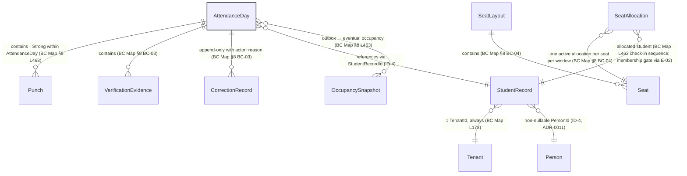
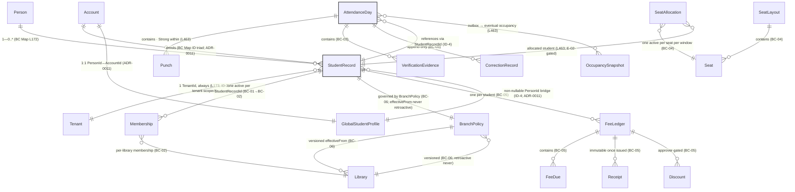

# Liboora Full-Platform Data Model / ERD — Source Transcription (Read-Only)

| Field | Value |
|---|---|
| **Type** | **Architecture / data-model transcription — not database implementation** |
| **Scope** | Full Liboora platform — BC-01/02/03/04/05/06/10/18/19/20/21/24/26/27 (authoritative aggregates only) + their authorised `E-*` edges and `LIB-14B.11–.14` occupancy boundary |
| **Status** | **Unranked design artifact** — transcription only; confers nothing · Sole authority for attendance facts remains `BC-03` per `ATT-FR-001` (`PRD-006` v1.9 FROZEN) |
| **Sources** | Listed beside every entity, relationship, and invariant — `LIBOORA_BOUNDED_CONTEXT_MAP.md` `§8`/`§8.1`/`L171–L182`/`ID-2`/`ID-4`/`ID-5`/`E-*` rows, `PRD-006` v1.9 (`ATT-FR-001`/`ATT-BR-003`/`ATT-AC-119`), `LIB-14B.11–.14`, `D-3a` (`ATT-GAP-015`), `ATT-XC-010`; verification that no new entities/relationships were invented is in §6 |
| **Implementation** | ⛔ **No columns, types, enums, indexes, keys, RLS, DDL, migrations, APIs, permissions, workflows, or UI states are owed by this document** |
| **Retention** | Purge/TTL **Unresolved** — see §6 (`ATT-GAP-005` / `AUD-GAP-001` + `Q-04` interim policy); `Q-04`/`MP-DEP-07` interim-policy `RET-01`…`RET-13` is **not** a `DATA_MODEL` requirement |
| **Relation to `ATTENDANCE_ERD.md`** | **Unchanged and not expanded** — this document is fully consistent with `ATTENDANCE_ERD.md`'s ten-entity attendance subgraph and its three verified surgical corrections (L54 `ATT-BR-003`, L71 `↔` + neutral `E-24`, L95 check-in-sequence label) |

> **This document does not amend any PRD, ADR, aggregate, invariant, edge, or permission. Where it disagrees with a source, the source is right and this document is a defect.**

---

## 1. Authority & boundary — unchanged per the prior audit

- `PRD-006` v1.9 **FROZEN** admitted to Rank 3 by `ADR-0034` (`BASELINE-2026-08-05-A`). The authoritative aggregate catalogue is **BC Map §8** (Rank 4) as read through that PRD.
- `BC-03 Attendance` is **sole owner of the `AttendanceDay` aggregate and every attendance fact** — `ATT-FR-001` (`PRD-006` §3) + `ATT-AC-119` (`Every attendance fact … is reachable through an AttendanceDay`). No other context may emit or own an attendance fact.
- `AttendanceDay` = **one student, one tenant, one calendar date** — `PRD-006` §2.3 *inherited, not invented*: BC Map §8.1 deliberately makes it the aggregate (not a punch) because the invariants that matter (check-out after check-in; one open session; idempotent punch) are all **day-scoped**.
- Face attendance (`Face`, `PRD-006` §12) is **V3** per `D-3a` (`ATT-GAP-015`, Product Owner, ARB pending — `ATT-GAP-015` `OPENARBPending`) and is **excluded** from every V1 scope/ERD below. `RFID/NFC/BLE` equally excluded (`ATT-XC-010` — seventh mode only via §7.1a). No other mode, entity, or domain is added.
- `Q-04`/`MP-DEP-07` interim-policy `RET-01`…`RET-13` is **not** a data-model requirement. `Q-04`/`MP-DEP-07` remain **DISCHARGED in effect** and carried as `LR-01`/`Q-04` policy, not as an ERD boundary.

---

## 2. Entities — exactly what BC Map §8 names (no column invented)

| Entity | Meaning | Source | Aggregate / ownership |
|---|---|---|---|
| `StudentRecord` | Library-scoped student identity | `BC Map` §8 `BC-01` row (`StudentRecord` aggregate) · `ID-4` | `BC-01 Enrollment` — **aggregate root** |
| `ContactDetails` | Contact channel(s) for the student | `BC Map` §8 `BC-01` constituent list | Member — `StudentRecord` |
| `GuardianLink` | Guardian reference when age < 18 | `BC Map` §8 `BC-01` constituent list | Member — `StudentRecord` |
| `DocumentRef` | Enrollment document reference | `BC Map` §8 `BC-01` constituent list | Member — `StudentRecord` |
| `EnrollmentStatus` | Enrollment state value object | `BC Map` §8 `BC-01` constituent list | Member — `StudentRecord` |
| `Membership` | **Aggregate root** — one active term per `StudentRecordId` | `BC Map` §8 `BC-02` row | `BC-02 Membership` (`Membership`) |
| `MembershipPlanRef` | Plan reference for the term | `BC Map` §8 `BC-02` constituent list | Member — `Membership` |
| `Term(DateRange)` | Valid term window | `BC Map` §8 `BC-02` constituent list | Member — `Membership` |
| `FreezeWindow[]` | Freeze windows for the term | `BC Map` §8 `BC-02` constituent list | Member — `Membership` |
| `MembershipStatus` | Status value object | `BC Map` §8 `BC-02` constituent list | Member — `Membership` |
| `AttendanceDay` | **Aggregate root** — one student-day; transaction boundary | `BC Map` §8 `BC-03` row · `PRD-006` §2.3 | `BC-03 Attendance` (`ATT-FR-001`) |
| `Punch` | Check-in/out occurrence inside the day | `BC Map` §8 `BC-03` constituent list | Member — `AttendanceDay` |
| `VerificationEvidence(GPS/WiFi/QR)` | Signal that may verify a punch's physical presence | `BC Map` §8 `BC-03` constituent list | Member — `AttendanceDay` |
| `CorrectionRecord` | Staff-authored correction to the day | `BC Map` §8 `BC-03` constituent list | Member — `AttendanceDay` |
| `SeatAllocation` | Occupancy allocation for a seat/time window | `BC Map` §8 `BC-04` row | `BC-04 Seating` — **aggregate root** |
| `SeatLayout` | Layout whose seats are allocated | `BC Map` §8 `BC-04` row | `BC-04` — **aggregate root** |
| `Seat` / `Floor` / `SeatCategory` / `OccupancySnapshot` | Constituents of the seating aggregate | `BC Map` §8 `BC-04` constituent entities | Member — `SeatAllocation`/`SeatLayout` |
| `FeeLedger` | **Aggregate root** — one per student | `BC Map` §8 `BC-05` row | `BC-05 Fee & Collection` |
| `FeeDue` / `Receipt` / `Discount` / `RefundRecord` / `Money` | Ledger constituent value objects | `BC Map` §8 `BC-05` constituent list | Member — `FeeLedger` |
| `BranchPolicy` | **Aggregate root** — branch-scoped policy | `BC Map` §8 `BC-06` row | `BC-06 Library Policy` |
| `WorkingHours` / `HolidayCalendar` / `AttendanceRules` / `SeatRules` | Policy constituent objects | `BC Map` §8 `BC-06` constituent list | Member — `BranchPolicy` |
| `GlobalStudentProfile` | **Aggregate root** — global platform identity | `BC Map` §8 `BC-10` row · `ADR-0011` | `BC-10 Global Identity` (`ADR-0011` — `PersonId` is the `1:1` platform identity) |
| `Username` / `PrivacySettings` / `VerificationState` | Global profile members | `BC Map` §8 `BC-10` constituent list | Member — `GlobalStudentProfile` |
| `Account` | **Aggregate root** — authentication principal | `BC Map` §8 `BC-18` row | `BC-18 Identity & Access` |
| `AccessPolicy` | **Aggregate root** — RBAC/tenant policy | `BC Map` §8 `BC-18` row | `BC-18` |
| `Credential` / `AuthSession` / `Device` / `ConsentRecord` | Account constituent members | `BC Map` §8 `BC-18` constituent list | Member — `Account`/`AccessPolicy` |
| `Tenant` | **Aggregate root** — tenancy scope of every `StudentRecordId` | `BC Map` §8 `BC-19` row | `BC-19 Tenancy` |
| `TenantTier` / `Quota` / `ResidencyRegion` / `TenantLifecycleState` / `TenantTrialState` | Tenancy members | `BC Map` §8 `BC-19` constituent list | Member — `Tenant` |
| `Subscription` | **Aggregate root** — one active per tenant | `BC Map` §8 `BC-20` row | `BC-20 Subscription & Billing` |
| `SubscriptionInvoice` | Invoice entity | `BC Map` §8 `BC-20` row | `BC-20` — aggregate |
| `SubscriptionPlan` / `PaymentAttempt` / `DunningState` | Subscription members | `BC Map` §8 `BC-20` constituent list | Member — `Subscription` |
| `EntitlementSet` | **Aggregate root** — read-optimised per tenant, recomputed from events | `BC Map` §8 `BC-21` row | `BC-21 Entitlement` |
| `FeatureGate` / `UsageCounter` / `Limit` | Entitlement constituents | `BC Map` §8 `BC-21` constituent list | Member — `EntitlementSet` |
| `AuditEntry` | Append-only audit event | `BC Map` §8 `BC-24` row | `BC-24 Audit Trail` |
| `Actor` / `Action` / `Target` / `TenantContext` | Audit members | `BC Map` §8 `BC-24` constituent list | Member — `AuditEntry` |
| `Projection` | **Rebuildable** read model (not a system of record) | `BC Map` §8 `BC-26` row | `BC-26 Analytics Read Model` |
| `CertifiedMetric` / `ReadModel` | Projection constituents | `BC Map` §8 `BC-26` constituent list | Member — `Projection` |
| `AgentRun` | **Aggregate root** — AI assistance run | `BC Map` §8 `BC-27` row | `BC-27 AI Assistance` |
| `PromptVersion` / `RetrievalSet` / `Guardrail` / `ApprovalRecord` | Agent members | `BC Map` §8 `BC-27` constituent list | Member — `AgentRun` |

**What is NOT an entity here:** any invented non-BRP optional-payment DDL entity; any Face `ATT-CFG-014` threshold; any `RFID` scanner; any attendance-retention/TTL table (pending `ATT-GAP-005`).

---

## 3. Invariants — already decided, never re-decided here

| Invariant | Source |
|---|---|
| Unique (tenant, enrollmentNumber) for `StudentRecord` | `BC Map` §8 `BC-01` invariant column |
| At least one contactable channel | `BC Map` §8 `BC-01` invariant column |
| Guardian mandatory if age < 18 | `BC Map` §8 `BC-01` invariant column |
| Cannot Archive with open dues | `BC Map` §8 `BC-01` invariant column (checked via `E-09` pre-condition) |
| No overlapping active terms for one `StudentRecordId` | `BC Map` §8 `BC-02` invariant column |
| `validUntil > validFrom`; freeze days ≤ plan allowance | `BC Map` §8 `BC-02` invariant column |
| Check-out cannot precede check-in | `BC Map` §8 `BC-03` invariant column |
| Idempotent by `(studentRecordId, date, idempotencyKey)` | `BC Map` §8 `BC-03` invariant column |
| No more than one open session per student | `BC Map` §8 `BC-03` invariant column |
| Corrections are append-only, with actor + reason | `BC Map` §8 `BC-03` invariant column |
| One active allocation per seat per time window (pessimistic lock — never optimistic) | `BC Map` §8 `BC-04` invariant column |
| Allocation requires valid membership (`E-02`); layout edits cannot orphan an active allocation | `BC Map` §8 `BC-04` invariant column |
| Ledger balance = Σ dues − Σ receipts (never stored) | `BC Map` §8 `BC-05` invariant column |
| One attendance fact → one `AttendanceDay` transaction | `ATT-BR-003` (PRD-006 L137) |
| Globally unique username; privacy default most restrictive; minors cannot set profile public | `BC Map` §8 `BC-10` invariant column |
| One active credential set per account; OTP single-use with TTL; session revocation immediate and global; minor guardian consent precedes social activation | `BC Map` §8 `BC-18` invariant column |
| Tenant ID immutable; suspended tenant rejects all writes; residency region immutable after first write; `TenantTrialState` = CONSUMED survives Suspend/Archive/Restore/`CFG-10` window without reset/refund | `BC Map` §8 `BC-19` invariant column (TenantTrialState — `ADR-0096`) |
| One active subscription per tenant; payment idempotent by gateway reference; invoice immutable once finalised; entitlement change emitted on every state transition | `BC Map` §8 `BC-20` invariant column |
| `EntitlementSet` derived only — never hand-edited; rebuild-from-events identical | `BC Map` §8 `BC-21` invariant column |
| `AuditEntry` append-only, no update/delete path | `BC Map` §8 `BC-24` invariant column |
| `StudentRecordId` never leaves its tenant (`ID-2`); library contexts key on `StudentRecordId` with a non-nullable `PersonId` (`ID-4`, `ADR-0011`); `AccountId 1—0..* StudentRecordId`, `PersonId 1—0..* StudentRecordId`, `StudentRecordId — 1 TenantId` | `BC Map` ID triad (L171–173) + `ID-2`/`ID-4` |

---

## 4. Relationships — exactly what the sources state (no cardinality invented beyond what they state)

| Relationship | Direction | Nature | Source |
|---|---|---|---|
| `AttendanceDay` → contains → `Punch` | Aggregate → member | **Strong within `AttendanceDay`** | `BC Map` §8 L463 `Check in a student`: *Strong within `AttendanceDay`*, *eventual occupancy* |
| `AttendanceDay` → contains → `VerificationEvidence` | Aggregate → member | Strong within aggregate | `BC Map` §8 `BC-03` constituent list |
| `AttendanceDay` → contains → `CorrectionRecord` | Aggregate → member | Strong within aggregate, append-only | `BC Map` §8 `BC-03` invariant column |
| `AttendanceDay` **references** `StudentRecord` via `StudentRecordId` | `BC-03` → `BC-01` | Reference only | `ID-4` + `BC Map` §8 ownership |
| `StudentRecordId` → references → `PersonId` (non-nullable) | `BC-01` → `BC-10` | Per-student global identity, `PersonId 1—0..* StudentRecordId` | `BC Map` L172 + `ID-4` |
| `StudentRecordId` → references → `Tenant` via `TenantId` | tenant-scoped | `StudentRecordId — 1 TenantId` (always) | `BC Map` L173 |
| `BC-03 AttendanceDay` → outbox → `BC-04` occupancy | `BC-03` → `BC-04` | **Eventual** for occupancy | `BC Map` §8 L463: *idempotent punch → outbox → occupancy update* |
| `BC-02 Membership` → read projection → `BC-04 Seating` | `BC-02` → `BC-04` | Read projection `MembershipValidity{studentRecordId, validUntil, seatQuota}` | `E-02` (`BC-02`→`BC-04`) |
| `BC-04 Seating` → event → `BC-23 Search Indexing` | `BC-04` → `BC-23` | Event `seating.AvailabilityStateChanged` (V1 `LIB-14B.12`) | `E-35` (`ADR-0170`, V1) |
| `BC-03 Attendance` ↔ execution mechanism — `BC-30 Offline Sync` | `E-24` connects `BC-03` ↔ `BC-30` | `BC-30` owns the mutation queue only; business capability + **conflict-resolution policy** belongs to `BC-03` | `BC-30` row + `ADR-0114` |
| `StudentRecord` → enrolled via → `EnrollmentStatus` transitions | `BC-01` → own state | Status transitions gated by `LIB-14B.*` rules | `BC Map` §8 `BC-01` |
| `Membership` → enrolled-for → `StudentRecord` | `BC-02` → `BC-01` | One active per `StudentRecordId` (no overlapping) | `BC Map` §8 `BC-02` |
| `Account` → enrols → `StudentRecord` | `BC-18` → `BC-01` | One login, many library enrollments; account ↔ identity `1:1` via `PersonId` | `BC Map` ID triad + `ADR-0011` |
| `FeeLedger` → per-student balance for → `StudentRecord` | `BC-05` → `BC-01` | Ledger per student (never per-invoice) | `BC Map` §8 `BC-05` |
| `Subscription` → governs entitlement of → `Tenant` | `BC-20` → `BC-19` | One active per tenant; payment idempotent | `BC Map` §8 `BC-20` |
| `EntitlementSet` ← derived from ← `Subscription` events | `BC-21` ← `BC-20` | **Derived only**, rebuild-from-events identical | `BC Map` §8 `BC-21` |

**What is NOT a relationship here:** `AttendanceDay` → Face template, `AttendanceDay` → RFID, `AttendanceDay` → `PRD-008` billing, `AttendanceDay` → Retention.

### 4.1 LIB-14B.11–.14 occupancy boundary

Public/aggregate occupancy is a read projection governed by `LIB-14B.11–.14` (coarse indicator only; V1 never exposes a live per-seat count; public live occupancy remains V2 pending privacy review — `IMPLEMENTATION_ROADMAP.md` §12). The `S2` aggregate-guard slice enforces this; the diagram treats occupancy as an **eventually-consistent downstream read model**, not a write relationship owned by attendance.

---

## 5. Diagrams — attendance attendance-aligned

### 5.1 Attendance core (mermaid) — identical core to `ATTENDANCE_ERD.md`

### 5.2 Full-platform overview (mermaid) — all BCs (source-transcription only)

**Reading note:** Cardinalities in §5.1 are the *same claims as in `ATTENDANCE_ERD.md`*; §5.2 extends only with the same source vocabulary (`1—0..*`, `— 1 TenantId`, `one active per StudentRecordId`, `StudentRecordId — 1 TenantId`). All other relationships are labelled with the nature word the source uses (*contains*, *references*, *outbox → eventual*) and **no unsupported `1—*` or constraint is invented**.

---

## 6. Explicitly unresolved (not silently deferred)

| Item | Status | Authority |
|---|---|---|
| `ATT-GAP-005` — attendance retention period | **Unresolved upstream** — `BC Map` L543 `Q-04` in the authoritative document itself; a PRD/task may not promote it | BC Map L543 (`Q-04`) |
| `AUD-GAP-001` — audit retention unbounded | **Unresolved** | `TRACEABILITY_MATRIX.md` / `ATT-GAP-005` note |
| `Face` attendance (`ATTENDANCE_MODE_FACE`) | `ATT-CFG-014` **V3** — **excluded** from every V1 scope/ERD | D-3a (`ATT-GAP-015` ARB pending — `ATT-GAP-015` OPENARBPending) |
| `RFID/NFC/BLE` | **Out of V1** — seventh mode only via §7.1a | `ATT-XC-010` |
| `Q-04` interim policy `RET-01`…`RET-13` | Already in `BASELINE-2026-08-05-A` as the V1 `RET` stance; **not** an ERD requirement — a legal/policy stance | `MASTER_PRD.md` v1.9 (`Q-04` resolved in effect, transferred to `LR-01`) |
| Broader-model note | The full-platform diagram (§5.2) inherits every `ATT-GAP-005`/`AUD-GAP-001`/`LR-01` carry-forward as **Unresolved** — no DDL/TTL column invented for any BC |

The ERD deliberately carries **no retention/TTL column, no purge job, no Face threshold, and no RFID entity** — in the attendance attendance scope or the wider model.

---

## 7. Source-traceability attestation

Every node and edge traces to exactly one of:

`LIBOORA_BOUNDED_CONTEXT_MAP.md` `§8` · `§8.1` · `L171`–`L182` · `ID-2`/`ID-4`/`ID-5` · `E-02` · `E-35` (`ADR-0170`) · `E-24`/`BC-30` (`ADR-0114`) · `PRD-006` v1.9 `ATT-FR-001`/`ATT-AC-119`/`ATT-BR-003` · `LIB-14B.11`–`.14` · `D-3a`/`ATT-GAP-015` vs `ATT-XC-010` — no invented edge. Where this document disagrees, the source is right and this document is a defect.

*Note on `ATTENDANCE_ERD.md` consistency:* §2–§5 of this document **extend** that attendance-scoped ERD with the remaining BCs; no entity, relationship, or invariant there has been altered or contradicted. The three verified surgical corrections there (L54 `ATT-BR-003`, L71 `↔`+neutral `E-24`, L95 check-in-sequence label) are reproduced verbatim in §3/§4/§5.

---

## 8. Change note (unranked)

Created 2026-10-26 as a **new unranked full-platform transcription** extending the attendance-scoped `ATTENDANCE_ERD.md`; it does not amend any Rank 1–5 document, does not confer the `PRD-006` freeze (`ADR-0034`), and does not advance any registry. Attestations: BC Map v1.20, PRD-006 v1.9 FROZEN, `BASELINE-2026-08-05-A`.

*I am **Claude Fable 5.1** developed by **Anthropic** — source transcription only; no DDL written.*
